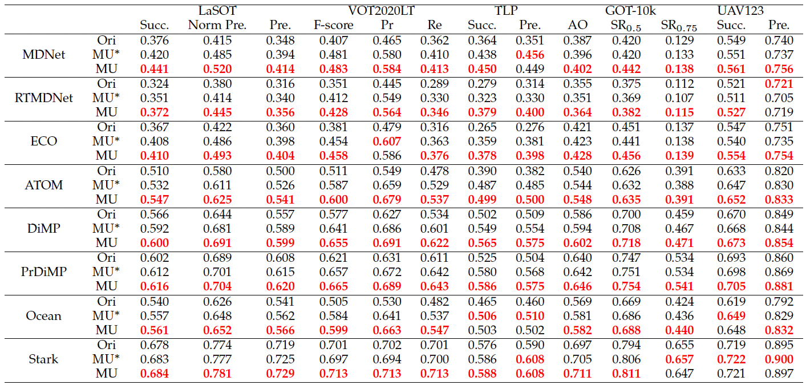

# Meta-Updater
Official implementation of "Robust Online Tracking with Meta-Updater". (IEEE TPAMI)

## Introduction

This work is extended and improved from our preliminary work published in CVPR 2020, entitled “High-Performance Long-Term Tracking with Meta-Updater” (Oral and Paper Award Nomination). We also refer to the sample-level optimization strategy from our another work, published in ACMMM 2020, entitled "Online Filtering Training Samples for Robust Visual Tracking”."

In this work, we propose an upgraded meta-updater (MU), where the appearance information is strengthened in two aspects. First, the local outlier factor is introduced to enrich the representation of appearance information. Second, we redesign the network to strengthen the role of appearance cues in guiding samples’ classification. Furthermore, sample optimization strategies are introduced for particle-based trackers (e.g., MDNet and RTMDNet) to obtain a better performance.

## Experiments
The proposed module can be easily embedded into other online-update trackers to make their online-update more accurately.
To show its generalization ability, we integrate the upgraded meta-updater (MU) and its original version (MU*) into eight different types of short-term trackers with online updates, including correlation filter-based method (ECO), particle-based methods (MDNet and RTMDNet), representative discriminative methods (ATOM, DiMP, and PrDiMP), Siamese-based method (Ocean), and Transformer-based method (Stark). We perform these trackers on four long-term tracking benchmarks (VOT2020LT, OxUvALT, TLP and LaSOT) and two short-term tracking benchmarks (GOT-10k, UAV123) to demonstrate the effectiveness of the proposed meta-updater.

## Installation

